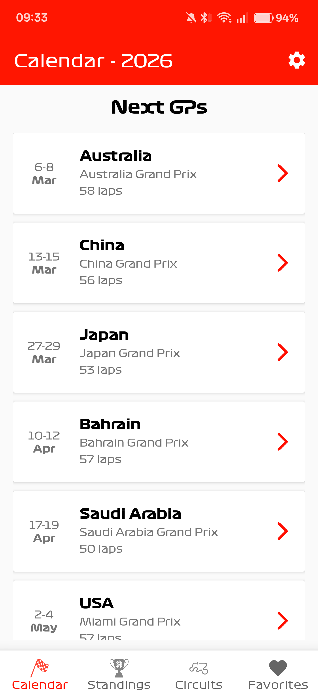
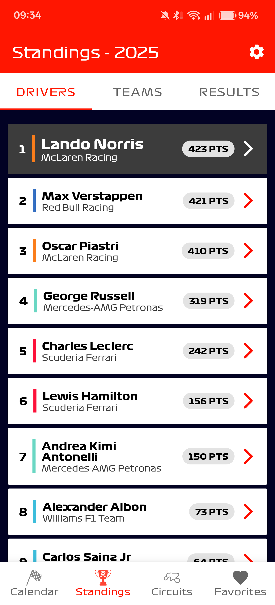
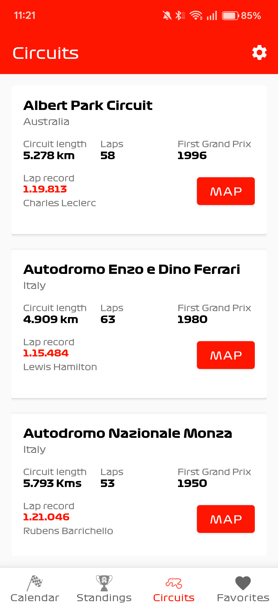
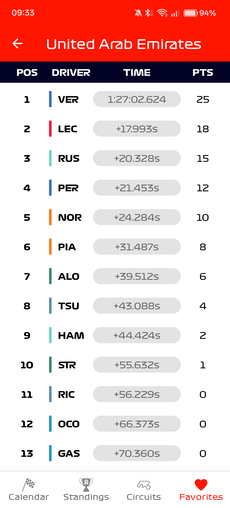
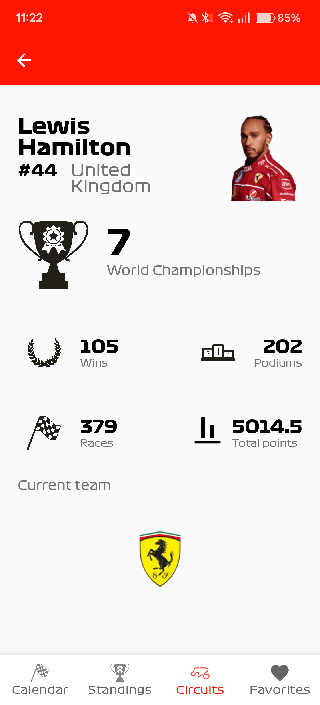
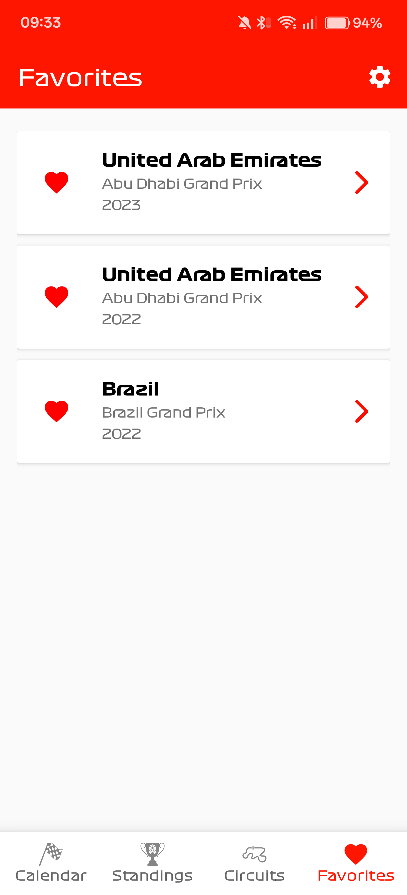

<div align="center">
  

# F1Stats

A native Android application for Formula 1 enthusiasts — browse race calendars, driver and team
standings, circuit information, and save your favourite races for quick access.
</div>

Built with modern Android development practices: **multi-module Clean Architecture**, **Jetpack
Compose**, **Kotlin Coroutines & Flows**, **Koin**, **Room**, and **Compose Navigation**.

---

## Screenshots

| Calendar                                                        | Standings                                                       | Circuits                                                       |
|-----------------------------------------------------------------|-----------------------------------------------------------------|----------------------------------------------------------------|
|  |  |  |

| Race Result                                                   | Driver Detail                                                        | Favourites                                                       |
|---------------------------------------------------------------|----------------------------------------------------------------------|------------------------------------------------------------------|
|  |  |  |

---

## Features

- **Race Calendar** — Full season schedule with countdown to the next GP, race details and session
  breakdowns
- **Driver & Team Standings** — Live rankings updated from the API-Sports F1 API
- **Race Results** — Detailed finishing order with times, fastest laps and team info
- **Circuit Browser** — Explore every circuit on the calendar with lap records and location data
- **Favourites** — Save races locally with Room; list updates reactively via Kotlin Flow
- **Season Selector** — Switch between historical seasons from Settings
- **Dark Mode** — Full dark theme support with system, light and dark options
- **Background Music** — Toggle the F1 theme from Settings
- **Accessibility** — Semantic headings, button roles, content descriptions and minimum touch
  targets

---

## Tech Stack

| Category             | Technology                                |
|----------------------|-------------------------------------------|
| Language             | Kotlin                                    |
| Architecture         | Multi-module Clean Architecture + MVVM    |
| UI                   | Jetpack Compose + Material 3              |
| Navigation           | Compose Navigation (type-safe)            |
| Dependency Injection | Koin                                      |
| Networking           | Retrofit + OkHttp + Gson                  |
| Local Storage        | Room (reactive `Flow`-backed DAO)         |
| Async                | Kotlin Coroutines + StateFlow/Flow        |
| Image Loading        | Coil 3 (Compose integration)              |
| Code Optimization    | R8 (minification, shrinking, obfuscation) |

---

## Architecture

### Multi-Module Structure

The project is split into four Gradle modules with strict dependency boundaries:

```
:app          Thin application shell — MainActivity, Koin DI modules
  :ui         Compose screens, ViewModels, theme, navigation graph, resources
    :data     Repositories, Retrofit services, Room database, DTO mappers
      :domain Pure Kotlin library — domain models, repository interfaces, use cases
```

**Dependency flow:** `:app` -> `:ui` -> `:data` -> `:domain`

Each module has a clear responsibility:

| Module    | Type            | Contains                                                                                                                            |
|-----------|-----------------|-------------------------------------------------------------------------------------------------------------------------------------|
| `:domain` | Pure Kotlin lib | Domain models (`Race`, `RankingDriver`, `Circuit`, etc.), repository interfaces, use cases. Zero Android dependencies.              |
| `:data`   | Android lib     | Concrete repository implementations, Retrofit service interfaces, Room database & DAOs, network DTOs, mappers, API configuration.   |
| `:ui`     | Android lib     | All Compose screens, ViewModels, Compose Navigation graph, theme (colors, typography), drawable/string resources, preview data.     |
| `:app`    | Application     | `F1StatsApp` (Application class), `MainActivity`, all Koin module definitions (network, database, repository, use case, viewmodel). |

### Dependency Inversion

Repository interfaces live in `:domain`, keeping use cases and models free of any framework
dependency:

```
:domain                          :data
  CircuitRepository (interface) <-- CircuitRepository (class implements interface)
  GetCircuitsUseCase(repo)          RetrofitService, DTOs, Mappers
```

Koin binds concrete implementations to their interfaces in `:app`:

```kotlin
single<ICircuitRepository> { CircuitRepository(get(), get()) }
```

### Data Flow

```
Compose Screen -> ViewModel -> UseCase -> Repository Interface -> Retrofit / Room
                  StateFlow    suspend     concrete impl           Network / DB
```

1. **Screen** observes `StateFlow` from the ViewModel via `collectAsStateWithLifecycle()`
2. **ViewModel** calls a use case on `viewModelScope` and updates state
3. **UseCase** delegates to a repository interface defined in `:domain`
4. **Repository** (in `:data`) calls Retrofit for network data or Room for local data
5. **Mappers** translate network DTOs into domain models before returning

### State Management

ViewModels expose a single `StateFlow` per observable piece of state. The UI layer collects these
flows with lifecycle awareness, ensuring no unnecessary recompositions or leaked subscriptions.

### DTO-to-Domain Mapping

Network responses are deserialized into data-layer DTOs via Gson. Mapper classes in `data/mapper/`
convert these into clean domain models, isolating the domain layer from API contract changes.

---

## R8 Optimization

Release builds use R8 for code shrinking, resource shrinking and obfuscation:

- **`:app`** — `minifyEnabled true`, `shrinkResources true` with project-level ProGuard rules
- **`:data`** — Consumer ProGuard rules (`consumer-rules.pro`) that travel with the library,
  preserving Gson-serialized models, Retrofit service interfaces and Room entities

---

## Accessibility

The app follows core Android accessibility guidelines:

- **Semantic headings** — Section titles use `semantics { heading() }` for screen reader navigation
- **Button roles** — Interactive cards declare `Role.Button` for correct TalkBack announcements
- **Content descriptions** — All icons and images provide meaningful descriptions via
  `contentDescription`
- **State descriptions** — Toggle elements (favourite buttons) announce their current state
- **Touch targets** — Interactive icons wrapped in `IconButton` to guarantee 48dp minimum touch area

---

## Getting Started

### Prerequisites

- Android Studio Ladybug or later
- JDK 17+
- An API key from [API-Sports](https://api-sports.io/) (free tier available)

### Setup

1. Clone the repository:
   ```sh
   git clone https://github.com/davmm96/F1Stats.git
   cd F1Stats
   ```

2. Add your API key — the key is configured as a `BuildConfig` field in `app/build.gradle`.

3. Build and run:
   ```sh
   ./gradlew assembleDebug
   ```
   Or open the project in Android Studio and run on a device or emulator.

### Build Commands

```sh
./gradlew build                  # Full build
./gradlew assembleDebug          # Debug APK
./gradlew assembleRelease        # Release APK (R8 enabled)
./gradlew test                   # Unit tests
./gradlew clean                  # Clean build artifacts
```

---

## License

This project is licensed under the MIT License. See the [LICENSE](LICENSE.md) file for details.
